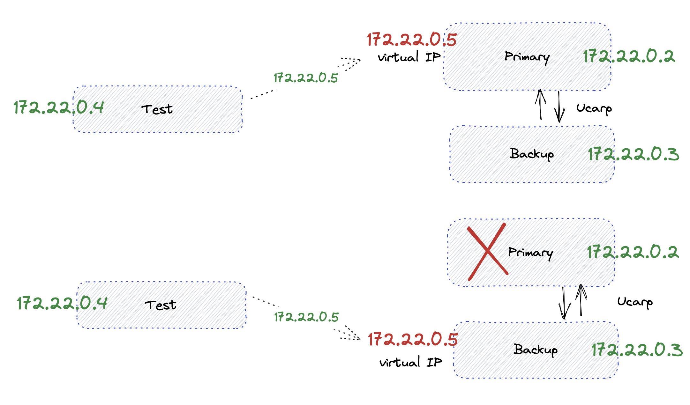

# Ucarp

## About

### ucarp
- A failover protocol
- It allows 2 servers in active-passive setup to share one (virtual IP)
- Only active is working, if it fails, passive takes over
- Think about having an active load balancer backed up by a passive one ready to jump in when the 1st is unavailable

## Environment

## Setup

`docker compose up -d`

## Experiment

